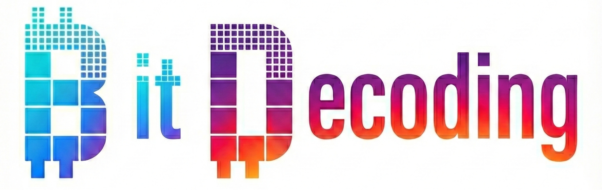
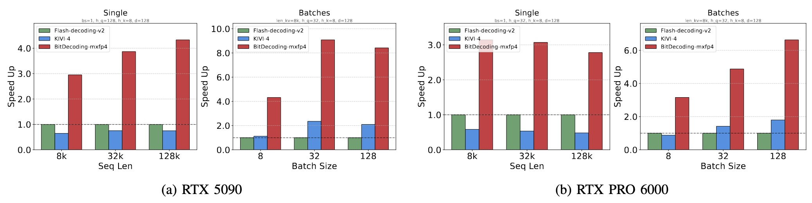

<p align="center">
  
</p>

<div align="center">

## Efficient LLMs decoding with low-bit KV cache

[](https://arxiv.org/abs/2503.18773)
[](LICENSE)

</div>


BitDecoding is a high-performance, GPU-optimized system
designed to accelerate long-context LLMs decoding with a low-bit KV
cache. Achieve **3-9x speedup** than Flash-Decoding-v2.


## News
* [2025.11] 🔥 BitDecoding has been accepted to HPCA 2026! 

## Benchmark
* Kernel Performance in Blackwell GPU



## Installation
```
git clone --recursive https://github.com/DD-DuDa/BitDecoding.git
conda create -n bitdecode python=3.10
conda activate bitdecode
pip install -r requirements.txt
python setup.py install
```

## Quick Start

```python
import torch
import math
from bit_decode import kvcache_pack_int, fwd_kvcache_int

# Parameters
batch_size, nheads, nheads_k, d = 1, 32, 32, 128
seqlen_q, seqlen_kv = 1, 4096
num_bits, group_size = 4, 128  # 4-bit quantization
quant_mode = "k-channel"
pack_nums = int(16 / num_bits)

# Input tensors
q = torch.randn(batch_size, seqlen_q, nheads, d, device="cuda", dtype=torch.float16)
k_cache = torch.randn(batch_size, seqlen_kv, nheads_k, d, device="cuda", dtype=torch.float16)
v_cache = torch.randn(batch_size, seqlen_kv, nheads_k, d, device="cuda", dtype=torch.float16)

# Quantized KV cache buffers
k_pack   = torch.zeros((batch_size, seqlen_kv // pack_nums, nheads_k, d), dtype=torch.uint16, device="cuda")
k_params = torch.zeros((batch_size, seqlen_kv // group_size, nheads_k, d), dtype=torch.float32, device="cuda")
v_pack   = torch.zeros((batch_size, seqlen_kv, nheads_k, d // pack_nums), dtype=torch.uint16, device="cuda")
v_params = torch.zeros((batch_size, d // group_size, nheads_k, seqlen_kv), dtype=torch.float32, device="cuda")
cu_seqlens_k = torch.arange(0, (batch_size + 1) * seqlen_kv, seqlen_kv, dtype=torch.int32, device="cuda")

# Pack KV cache
kvcache_pack_int(k_cache, k_pack, k_params, v_cache, v_pack, v_params,
                 None, cu_seqlens_k, seqlen_kv, quant_mode, group_size, num_bits)

# Decode with BitDecoding
output = fwd_kvcache_int(q, k_pack, k_params, v_pack, v_params, None,
                         1.0 / math.sqrt(d), quant_mode, group_size, num_bits)
```

## Examples

- **Benchmark notebook**: See [benchmark/bench_single_decode.ipynb](benchmark/bench_single_decode.ipynb)
- **End-to-end inference**: See [e2e branch](https://github.com/DD-DuDa/BitDecoding/tree/e2e)
- **(Optional) LibTorch C++ build**:
    ```bash
    cd BitDecoding/csrc/bit_decode
    mkdir build && cd build
    cmake -DCMAKE_PREFIX_PATH=<libtorch_path> ..
    make -j12
    ```

## Citation
If you find BitDecoding useful or want to use in your projects, please kindly cite our paper:
```
@misc{du2025bitdecodingunlockingtensorcores,
      title={BitDecoding: Unlocking Tensor Cores for Long-Context LLMs with Low-Bit KV Cache}, 
      author={Dayou Du and Shijie Cao and Jianyi Cheng and Luo Mai and Ting Cao and Mao Yang},
      year={2025},
      eprint={2503.18773},
      archivePrefix={arXiv},
      primaryClass={cs.AR},
      url={https://arxiv.org/abs/2503.18773}, 
}
```

## Acknowledgement
BitDecoding is inspired by many open-source libraries, including (but not limited to) [flash-attention](https://github.com/Dao-AILab/flash-attention/tree/main), [flute](https://github.com/HanGuo97/flute), [Atom](https://github.com/efeslab/Atom), [omniserve](https://github.com/mit-han-lab/omniserve), [KIVI](https://github.com/jy-yuan/KIVI).
